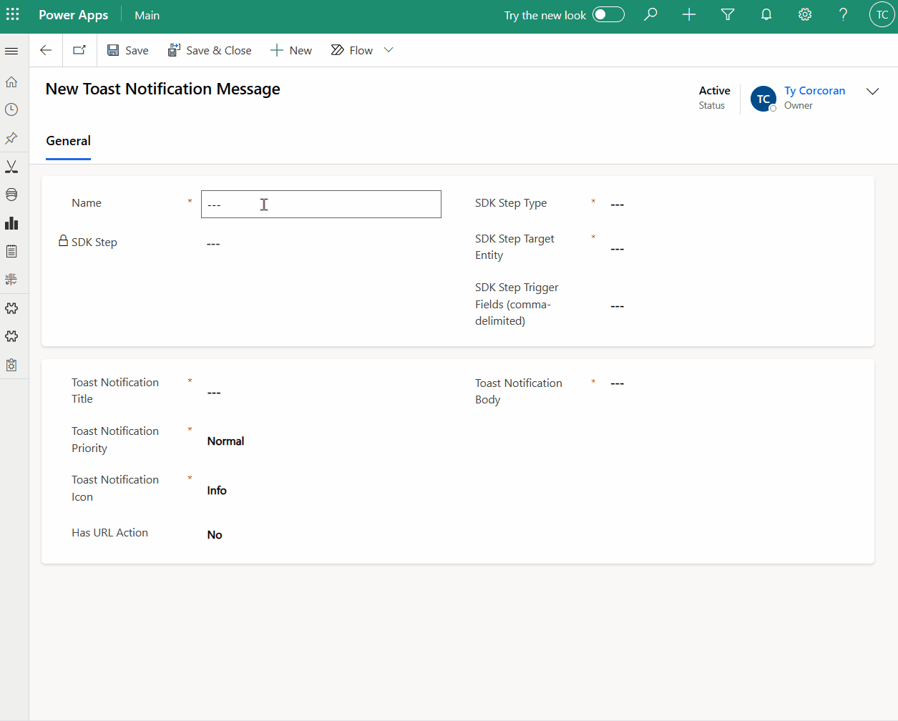

  
  
  
  
  
  
  <h1>Toast Notification Framework for Dynamics 365</h1>

- [Summary](#summary)
- [Demo](#demo)
- [Usage](#usage)

### Summary

My goal with this project was to create tool that non-developers could use to create, edit, dispatch and disable in-app/toast notifications in Dynamics 365.

For more information on the in-app notification feature please see the below links:

[MS Learn - Send in-app notifications](https://learn.microsoft.com/en-us/power-apps/developer/model-driven-apps/clientapi/send-in-app-notifications)
[MS Learn - Notification (appnotification) table/entity reference](https://learn.microsoft.com/en-us/power-apps/developer/data-platform/reference/entities/appnotification)

### Demo

  

### Usage

**[1] Enable the toast notification feature within model-driven apps**

**[2] Import solution**

Managed and unmanaged solutions are included in [solutions](./solutions) folder

**[3] Provide security roles to users**

Certain privileges are required in order to use in-app notifications in Dynamics. Those privileges are applied to roles included within the solutions folder so feel free to use those roles or merge with your own. The privileges for the Toast Notification Reader role are required to allow users to manage their in-app notification settings within a model-driven app. I recommend using Jonathan Daugaard's "Users, Team and Security Role Report" XrmToolBox plugin to bulk apply the reader/contributor roles as necessary.

- Toast Notification Administrator
- Toast Notification Contributor
- Toast Notification Reader

**[4] Creating a toast notification**

Navigate to the tldr-dynamics model driven app and select **toast notification messages** then add new from the ribbon.

Complete all required fields:

- Name: This is the toast notification name and what will be used when naming the plugin message. This is not custom-facing
- SDK Step Type: Select Create or Update indicating what message the background plugin should be registered with
- SDK Step Target Entity: The schema name of the table that will trigger the toast notification message
- SDK Step Trigger Fields (comma-delimited): For update messages, provide schema names for fields that should trigger the notification on update
- Toast Notification Title: Customer-facing title of the toast notification. Limited to 30 characters as that is when truncation will kick in on UI. Supports markdown.
- Toast Notification Priority: Normal or high
- Toast Notification Icon: Determines icon to be displayed on notification (info, success, failure, warning and mention).
- Has URL Action: Enables link to target record
- Toast Notification Body: Supports markdown and {{handlebars}} syntax. One can provide field schema names in handlebar syntax in order to provide formatted values for field types like lookup, currency, etc.

<ins>Disabling a toast notification</ins>
Simply deactivating the toast notification message record will deactivate the corresponding sdk processing step message in the background

**[5] Validating the notification was created**
If you would like to confirm that your toast notification was created, navigate to https://yourcrm.crm.dynamics.com/api/data/v9.2/appnotifications

📌 Coming soon 📌

- Adding filters to update messages so that they are only triggered when certain criteria is met

To provide suggestions or feedback please create an issue in this repo and I will respond as soon as I can
